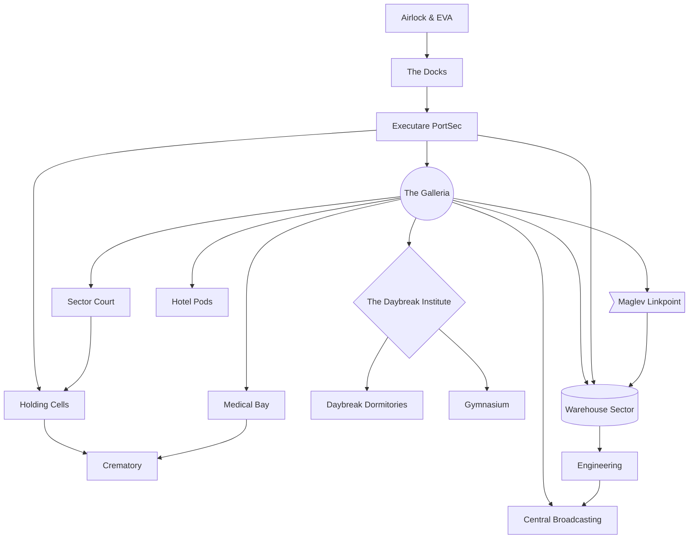

# An Introductory Adventure

## How Does This Work?

Think of the adventure as having parts where it goes wide, and then other parts where it gets really narrow again.

Any time the players are required to attend something by X0XI, they cannot avoid it.
When it's time for The Presentation, the players just start the scene, there, at The Presentation,
as if they're teleported there by X0XI. If they were imprisoned or trapped, they'd still be at The Presentation.
If the players ask how this works, the answer is "magic".

## Day 1

* The Players land on the planet. One extra teenager never wakes up from their transport capsule.
* The Players are introduced to Paradise Lua by their digital guide, X0XI ("Shoshi").
* Their dormitory turns out to be uninhabitable: they will need to find a place to sleep, and food.
* The players are allowed to explore, but must return by 1900 for The Presentation.
* They are only allowed to roam in the Yellow Division, for now.
* The players are summoned for The Presentation.
* The lost teenager forms a Crimson Starlight Angel and the players have to fight them.
* They win: this produces a Mystical MacGuffin.
* The Players are once again free to roam.

## Day 2

* The Players are once again free to roam the halls of Paradise Lua
* At 800-900, they attend Orientation, at which point they're free for the rest of the day.
* The goal is finding Mystical MacGuffins.
* The Players are drawn into conflict with The Executare.
* That'll keep them busy enough for the rest of the day.

## Day 3

* at 1900 they have another Presentation
* at the Presentation they are confronted by The Chariot
* The Chariot forms a Crimson Starlight Angel and the players have to fight them.