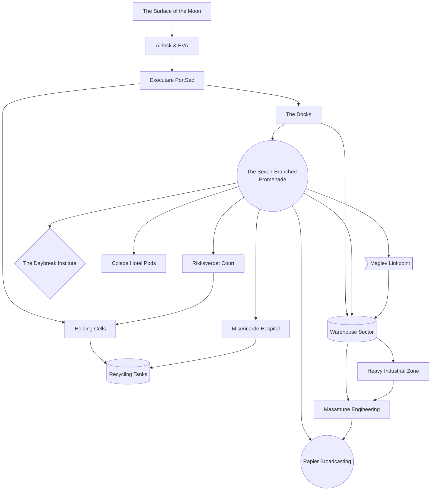

# Joyeuse Division

This is the "entrance" to Paradise Lua, and the place where players will spend their first few sessions.

## Map

* [Airlock & EVA](./joyeuse/airlock.md) - The Fool
* [Executare PortSec](./joyeuse/police.md)
* [The Docks](./joyeuse/docks.md)
* [The Seven-Branched Promenade](./joyeuse/promenade.md)
* [The Daybreak Institute](./joyeuse/daybreak.md) - Five of Swords
* [Colada Hotel Pods](./joyeuse/hotel.md) - Four of Swords
* [Warehouse Sector](./joyeuse/warehouse.md) - Seven of Swords
* [Rikksverdet Court](./joyeuse/court.md) - Two of Swords
* [Maglev Linkpoint](./joyeuse/maglev.md) - Six of Swords
* [Misericorde Hospital](./joyeuse/hospital.md) - Ten of Swords
* [Masamune Engineering](./joyeuse/engineering.md) - Ace, King of Swords
* [Heavy Industrial Zone](./joyeuse/industrial.md)
* [Holding Cells](./joyeuse/prison.md) - Eight of Swords
* [Recycling Tanks](./joyeuse/recycling.md) - Three of Swords
* [Rapier Broadcasting](./joyeuse/broadcast.md) - Page, Queen, Knight of Swords
* [The Surface of the Moon](./joyeuse/surface.md) - Nine of Swords

## Swords

Things in Joyeuse tend towards a "sword" theme.

Joyeuse Division contains the ports, the police, the military-industrial complex - and, of course, The Daybreak Institute.

This part of Paradise Lua tends toward utilitarian, gunmetal gray architecture with large, clear, easy-to-read black-and-yellow signage to
discourage workers from injuring themselves.
It exists in varying states of disrepair, some of it rusting and ill-maintained.

The Seven-Branched Promenade is a light commercial area - nowhere near as opulent as Florin Divison's Gigamall, but sufficient for various and sundry.

### Inspiration Board - Pipes, Tubes, Catwalks, Tanks, Containers, Extra-Large Industrial Equipment.
