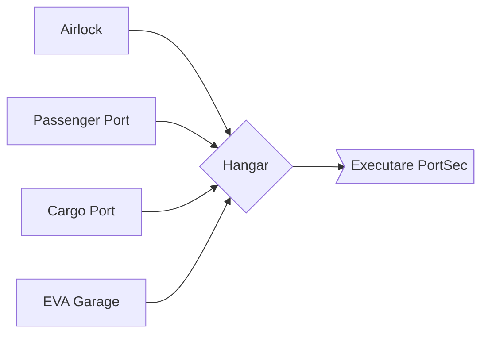

# Airlock & EVA

This is the first thing that you encounter on Paradise Lua. The entrance.

On their first time through Airlock & EVA, players are quickly ushered out and through, and don't get a chance to fully
explore it as much as they would like.

Even if they do return, the airlock has security safeguards out the actual wazoo: PortSec won't let them back out
to the Airlock, and even if they do, there are systems in place to keep random citizens from walking out
into space.

## Passenger Port

## Cargo Port

## Airlock
This is just a door that leads out, on to the Moon.

The Airlock always has a security detail, and the outer and inner doors require an Airlock Keycard to open,
or an Unlikely SCI check to hack the Keycard panel.

Thing is, there's no air on the Moon. (Citation needed.)

The way an airlock works is that there are two airtight doors: an outer door, and an inner door.

This limits the amount of air that can escape at any given time: so long as both doors
are never open at the same time, there's no path for air to directly escape.

But it's a little more complicated than that: rapid depressurization or repressurization can be
traumatic - it's hard on mechanical components, causes windows to fog up, and is no party for the
humans involved, either. So, transit through the airlock involves a hour-long wait while the
pressure inside the airlock aligns itself with the air pressure either inside or outside, and they

This depressurization step can be overridden with a Hard SCI check, although it's... not recommended,
except in an emergency. Check [The Moon: Going Outside Will Kill You](../../the_moon.md#going-outside-will-kill-you) for information
about what happens. (Hint: it bad.)

Sitting just outside of the Airlock are a handful of EVA Suits, in locked closets.
Unlocking the closets requires an Airlock Keycard.

## EVA Garage

## Hangar
An enormous, busy hangar with uniformed staff and cargo robots scuttling around.

## Executare PortSec

That's [this next page.](./police.md)