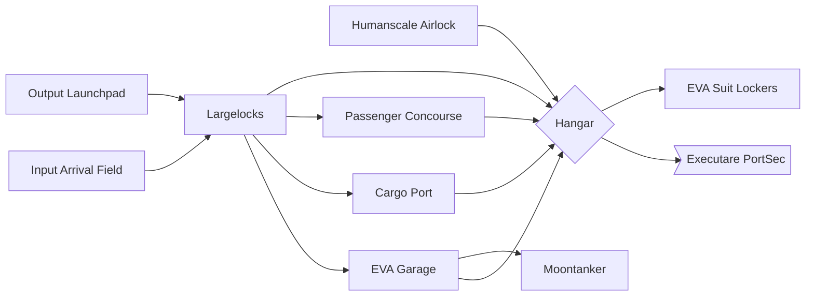

# Airlock, Docks, & Two Smoking EVAs

This is the first thing that you encounter on Paradise Lua. The entrance.

On their first time through Airlock & EVA, players are quickly ushered out and through, and don't get a chance to fully
explore it as much as they would like. Should they return - which isn't necessarily an easy feat, the Executare PortSec
doesn't care for bystanders casually hanging out at the ports - they'll find a bustling transport hub.

Each of the Humanscale Airlock, the Passenger Concourse, the Cargo Port and the EVA Garage have their own airlocks.

## EVA
"EVA" stands for Extravehicular Activity, and it means "doin' stuff in space outside of a spaceship".

## Map

### Passenger Concourse

Passengers and Cargo are both delivered to the station in nearly identical Containers.
The treatment of different categories of Container varies wildly, however.

Human Containers, bus-sized and filled with padded seats and safety restraints,
are treated with the second-highest level of care: collected from the
Input Arrival Field, carried through a 15-30 minute wait in the Largelocks,
and delivered gently to the Passenger Port where they can
step out on to the concourse. This is how the players arrive on the station.

While the loud bustle of the rest of the Hangar can be heard from the concourse,
it's muffled, as the concourse itself is enclosed, with a lower ceiling, insulated
from the rest of the proceeding, with a large window through which its passengers
can watch the hustle and the bustle of the Hangar.
The seating in the concourse is low and 60's era post-modern, surrounded by small circular
tables. The carpeting was once a bold orange, and is now... faded and threadbare.

A few plastic palm trees are littered about. There is a large, visible clock in the room.
There's a bar, with stools lined up against it, but there's no sign of any bottles or glassware
remaining there.

The stately DEPARTURES and ARRIVALS board has enough space for six departures and arrivals in a single day,
but lists only one ARRIVAL: the players. Nobody else has departed or arrived today.

Honestly, just look at the [TWA Hotel](https://landlopers.com/2020/02/20/twa-hotel),
it looks like that, but _before_ the restoration.

It's clear from both the opulence and the dust of the passenger concourse that
folks willing to front the money for the expensive journey to Paradise Lua
are few and far between.

### Humanscale Airlock
This is just a door that leads out, to the Moon.

The Airlock always has a security detail, and the outer and inner doors require an Airlock Keycard to open,
or an Unlikely SCI check to hack the Keycard panel.

Thing is, there's no air on the Moon. (Citation needed.)

The way an airlock works is that there are two airtight doors: an outer door, and an inner door.

This limits the amount of air that can escape at any given time: so long as both doors
are never open at the same time, there's no path for air to directly escape.

But it's a little more complicated than that: rapid depressurization or repressurization can be
traumatic - it's hard on mechanical components, causes windows to fog up, and is no party for the
humans involved, either. So, transit through the airlock involves a hour-long wait while the
pressure inside the airlock aligns itself with the air pressure either inside or outside, and they

This depressurization step can be overridden with a Hard SCI check, although it's... not recommended,
except in an emergency. Check [The Moon: Going Outside Will Kill You](../../the_moon.md#going-outside-will-kill-you) for information
about what happens. (Hint: it bad.)

### Cargo Port
Many other containers flow back and forth through the station.

Things are at their busiest
after a fresh barge has landed, when containers are picked off of the
Input Arrival Field by EVA Cargo Trucks in order of their perishability, with humans obviously _first_. (ish)

In the Cargo Port, containers are loaded on to the [HIZ](./industrial.md) Maglev Loop for distribution to the
[Warehouse Sector](./warehouse.md) and the [HIZ](./industrial.md).

Now, I know what you're thinking: why have the Maglev lines _inside_ the pressurized facility rather than _outside_?
Outside they don't have to contest with drag, allowing for _extremely_ efficient and high-speed transport: but,
the HIZ Maglev Loop is only about 40km long, and distribution _within_ the facility would be complicated by
having to have a full airlock at every possible load and unload point.

#### A Note on Interplanetary Trade and the Earth Side of the Transaction

Thanks to the dramatic difference in escape velocity, shipping from Earth to Paradise Lua is an order of magnitude more
expensive than shipping from Paradise Lua to Earth, so shipping from Paradise Lua tends towards heavy containers full
of valuable (and not terribly delicate) rare metals, which are flung at Earth with some abandon and tend to leave
very expensive craters in the Nevada desert. This is widely considered fatal to humans (although it is quite survivable
for piles of vanadium) so non-cargo trips between the two planets are considerably more expensive and difficult.

Anything shipped from Earth, fired out of the Nevada HEO Supercannon, is going to be a hyper-expensive luxury item on Paradise Lua,
tending towards low-density items that are impossible to replicate on the moon, like seeds, polymers, and electronic components.
Again, humans are not generally capable of surviving the acceleration of the HEO Supercannon, so human round trips require
more traditional rocketry and re-entry and tend to cost eye-watering sums of money to arrange.

### Output Launchpad
The Moon's escape velocity is a mere 8500 km/h, child's play compared to the 40,000 km/h required on Earth.

Getting cargo to that velocity is accomplished with a large magnetic railgun mounted next to Paradise Lua.

Preparing containers to ship to Earth,
is a constant source of work: two shifts a day, 12 hours each, with the night shift more sparsely staffed.

### Input Arrival Field
Large Container Barges land on the Input Arrival Field.

Before the Large Container Barges land, they shoot their Mass Driver at the Input Arrival Field,
offsetting large amounts of their incoming momentum to provide a softer landing. The Mass Driver hits
with an incredible amount of force - it would be incredibly loud if there was an atmosphere
 to carry the shockwave.

When a shipment _from_ Earth arrives, every dockworker is expected to work non-stop until the last container gets
completely unloaded, generally a 30-48 hour shift. Amphetamines are provided by management.

### Hangar
An enormous, busy hangar with uniformed staff and cargo robots scuttling around.

### Largelocks
The Largelocks are airlocks that are... well, large, big enough for several EVA Cargo Trucks at once.

### EVA Garage
This is where the Moontrikes, Moonvans, EVA Cargo Trucks and the Moontanker are stored.

#### Moontrikes
Three wheels, some spare air and water tanks, and a not overlong battery life. If a Moontrike runs
into trouble it's close enough to Paradise Lua that a rescue team can _usually_ get to it before oxygen
levels get critical.

#### Moonvans
Moonvans are armored like battle tanks, because they're protecting big batteries and
pressurized air tanks: a badly timed meteorite strike could leave an EVA team stranded
and very likely dead.

They don't have pressurised cabins of their own, though: even inside, riders have to keep their suits on.

#### EVA Cargo Trucks
These trucks are much larger than Earth trucks, each one featuring a crane arm capable of loading up to
four 40ft Containers, which sit 2x2 on the truck's bed.

#### Moonves
[Les Moonves](https://en.wikipedia.org/wiki/Les_Moonves), born 1949, was the CEO of CBS for a few decades.
He does not feature in this game and his inclusion in this page was a mistake.

### Moontanker

The wheels of the Moontanker tower feet higher than even the tallest player.
The Moontanker is a yacht-sized armored EVA unit, the only one with a self-contained pressurized cabin,
plumbing, all of the equipment an EVA team would need to spend days or even weeks on a
Moon expedition.

### EVA Suit Lockers

Rows and rows of fully-charged EVA Suits, each in an individual locked closet.
Unlocking the closets requires an Airlock Keycard or a Hard SCI check.

### Executare PortSec

That's [this next page.](./police.md)

## Dockworkers

The Dockworkers wear orange jumpsuits. Most Dockworkers are pretty adept vehicle pilots, and as some of the only
citizens who get to regularly go on EVA missions, they have a reputation for being courageous, cocky and daring.

Of course, they earn this reputation with their well-higher-than-usual death rate: safety regulations in the docks are
middling and there are lots of ways for EVA missions to go sideways fast.

The Dockworkers' Credo is "EVA Suits Don't Grow on Trees". Check the side of the EVA suits: each of them has a hand-written name,
("Sally", "Dirk"), and many of them have a small tally kept on the side, the number of workers who've died in them.
(Don't worry: they're cleaned and refurbished thoroughly each time.)
These suits are unimaginably precious to the Dockworkers: some of them will wear the suit of a lost friend in their memory,
some of them will superstitiously pick the exact same suit every time: they get attached.

Sometimes folks will try and steal suits for their own joyrides on the Moon. If PortSec doesn't get them, the Dockworkers
are _not_ friendly with outsiders touching their suits, but they're usually kind enough to leave the culprits with nothing
more than a few broken limbs and a light concussion.

There's one EVA Suit that has a higher tally on the side than any of the others, "Gregori" - the tally takes up so much space
on the Suit that it's very obvious. 78. The Eggheads say that they've gone over Gregori with a fine-toothed comb and it is
perfectly safe. The Dockworkers are convinced that Gregori is cursed and do their best not to pull Gregori from the racks.
They're a little less attached to Gregori than the other suits,
and players might be able to make off with this one without a fight, even: but Gregori is _yes, actually, well and truly cursed_.

There are about 30 Dockworkers, total.

## 78 Airlock Ideas

* **Ace of Swords**: One of [Masamune's engineers](./engineering.md), Dr. Prairie, a tall man in a lab coat with a long nose and greasy black hair,
    is on-site with a small team of Eggheads.
   * The air systems have identified that there is a pinhole leak, somewhere in the Hangar,
    and they're trying to find the source by walking around with a brazier kicking off a pungent purple smoke, but struggling:
    unlike in the smaller rooms present in much of the rest of the station, the Hangar is a little too big for this to be an effective strategy
    and the brazier's smoke mostly just gets carried off by the HVAC.
   * The Dockworkers are doing everything they can to make this irritating for the engineers: rearranging containers to block their path,
    saying "I think I found the source of the leak" and directing the Eggheads to their own asses (ho ho ho!),
    and generally making nuisances of themselves.
   * Dr. Prairie will frustratedly explain that pinhole leaks can lead to much more serious structural damage.
   * If nobody intervenes in this for a while, a hole will open in one of the hanger walls with a deafening screech,
    sucking a dockworker through, who will rapidly suffocate to death.
   * A few Dockworkers will strap in to EVA suits and rush over, working together to surround the hole with a sticky, adhesive foam,
    then covering it with a thick steel panel.
* **2 of Swords**: (difficult decision)
* **3 of Swords**: Steve D'ore, a 73-year-old dockworker and grandfather, clutches his chest and keels over. Nobody appears to be helping him.
   * He is having a heart attack and he will only survive if he receives prompt medical attention.
   * When Medical Care is summoned, either by the players or after someone finally checks on Steve's dying body, a team of white-and-red-pinstripe
     paramedics from [Misericorde Hospital](./hospital.md) rush in with a Crash Cart. If they're prompt, they'll busily cart Steve off (and Steve will survive,
    the players will be able to find him later in Misericorde) - if not, they'll check Steve, call time of death, zipper him up into a body bag, and
    cart him off at a much more relaxed pace.
* **4 of Swords**: An exhausted dockworker passes out at the wheel of his EVA Cargo Truck and smashes into the Largelock outer door, damaging it.
   * All hands are now on deck to try and get the Largelock repaired: the Largelocks are a flurry of activity.
* **5 of Swords**: A team of PortSec Executare are on patrol, led by Sgt. Starman, a squat, beefy man with his head shaved.
   * They're bristling for a fight: they might pick a fight with the Dockworkers, but they'd even more like to pick a fight with the players.
* **6 of Swords**: The Maglev is not working properly: there's a red light blinking above the maglev tunnel, and cargo is piling up in the hanger.
   * This happens to the Dockworkers pretty regularly at this point and they're perfectly happy to sit on their hands and let cargo pile up,
   * Except for Junior Supervisor Speff Brinkley, who is convinced (he's probably not incorrect) that if he doesn't get this resolved quickly,
     he will be the one who is blamed/fired over it.
   * The Eggheads are dragging their feet about sending someone to manage getting the Maglev reactivated.
* **7 of Swords**: The Dockworkers are organizing a raffle draw. Buy a card for 20 credits and, if it's drawn, win the pot.
   * If players win, they might get jumped by some angry Dockworkers.
* **8 of Swords**: (prison) A team of PortSec Executare are carting off Dockworker Bagels for a crime that Bagels didn't commit.
   * One of the Executare committed the crime and has pinned it on Dockworker Bagels.
* **9 of Swords**: (anxiety / space) there's something outside and it's terrifying
* **10 of Swords**: (trauma)
* **Page of Swords**: (exploration)
* **Knight of Swords**: ADHD
* **Queen of Swords**: journalism (direct, clear, independent)
* **King of Swords**: mastermind
* **Ace of Cups**: emotions
* **2 of Cups**: partners
* **3 of Cups**: shots shots shots
* **4 of Cups**: careful
* **5 of Cups**: Ontario, a young hotshot who's been working for 20 hours and is on no small dose of amphetamines, has
piled up some detritus outside and is circulating his plans to jump it with a Moontrike.
   * The players overhear some of the younger Dockworkers talking about their plans to watch him and see what happens.
   * One of them, Kett, is convinced that Ontario is going to kill himself if
     he tries it, but nobody is listening, to Kett. (Kett is right, and Ontario _will_ try it and he _will_ fatally injure himself.)
* **6 of Cups**: It's "Bring Your Child to Work Day".
* **7 of Cups**: ADVERTISING!
* 8 Cups: Abandonment
* 9 Cups: Contentment
* 10 Cups: Happy ending
* P Cups: Conman
* Kn Cups: Knight of Love
* Q Cups: psychiatrist
* K Cups: Diplomat
* A Pentacles: Payday
* 2 Pentacles: Juggling
* 3 Pentacles: Teamwork
* 4 Pentacles: Saving
* 5 Pentacles: Poverty
* 6 Pentacles: Charity
* 7 Pentacles: Growth
* 8 Pentacles: Industry
* 9 Pentacles: Luxury
* 10 Pentacles: Inheritance
* P Pentacles: Venture Capital
* Kn Pentacles: Discipline
* Q Pentacles: Martha Stewart
* K Pentacles: Failson
* A Wands: wink
* 2 Wands: Planning
* 3 Wands: progress
* 4 Wands: Festival
* 5 Wands: Robot Fight!
* 6 Wands: Victory
* 7 Wands: Tournament
* 8 Wands: Travel
* 9 Wands: Courage
* 10 Wands: Burden
* Kn Wands: Adventure Idiot
* Q Wands: Social Network
* K Wands: Visionary
* Fool
* Magician
* High Priestess
* Empress
* Emperor
* Hierophant
* Lovers
* Chariot
* Strength
* Hermit
* Wheel of Fortune
* Justice
* Hanged Man
* Death
* Temperance
* Devil
* Tower
* Star
* Moon
* Sun
* Judgement
* World

### 78 ideas template
* A Swords: thought
* 2 Swords: hard decisions
* 3 Swords: heartbreak
* 4 Swords: rest
* 5 Swords: fight
* 6 Swords: travel
* 7 Swords: swindle
* 8 Swords: prison
* 9 Swords: anxiety
* 10 Swords: trauma
* P Swords: exploration
* Kn Swords: ADHD
* Q Swords: journalism (direct, clear, independent)
* K Swords: mastermind
* A Cups: emotions
* 2 Cups: partners
* 3 Cups: shots shots shots
* 4 Cups: careful
* 5 Cups: regret
* 6 Cups: nostalgia/children
* 7 Cups: ADVERTISING!
* 8 Cups: abandonment
* 9 Cups: contentment
* 10 Cups: happy ending
* P Cups: conman
* Kn Cups: knight of love
* Q Cups: psychiatrist
* K Cups: diplomat
* A Pentacles: payday
* 2 Pentacles: juggling
* 3 Pentacles: teamwork
* 4 Pentacles: saving
* 5 Pentacles: poverty
* 6 Pentacles: charity
* 7 Pentacles: growth
* 8 Pentacles: industry
* 9 Pentacles: luxury
* 10 Pentacles: inheritance
* P Pentacles: venture Capital
* Kn Pentacles: discipline
* Q Pentacles: martha stewart
* K Pentacles: failson
* A Wands: wink
* 2 Wands: planning
* 3 Wands: progress
* 4 Wands: festival
* 5 Wands: robot fight!
* 6 Wands: victory
* 7 Wands: tournament
* 8 Wands: travel
* 9 Wands: courage
* 10 Wands: burden
* Kn Wands: adventure idiot
* Q Wands: social network
* K Wands: visionary
* Fool
* Magician
* High Priestess
* Empress
* Emperor
* Hierophant
* Lovers
* Chariot
* Strength
* Hermit
* Wheel of Fortune
* Justice
* Hanged Man
* Death
* Temperance
* Devil
* Tower
* Star
* Moon
* Sun
* Judgement
* World