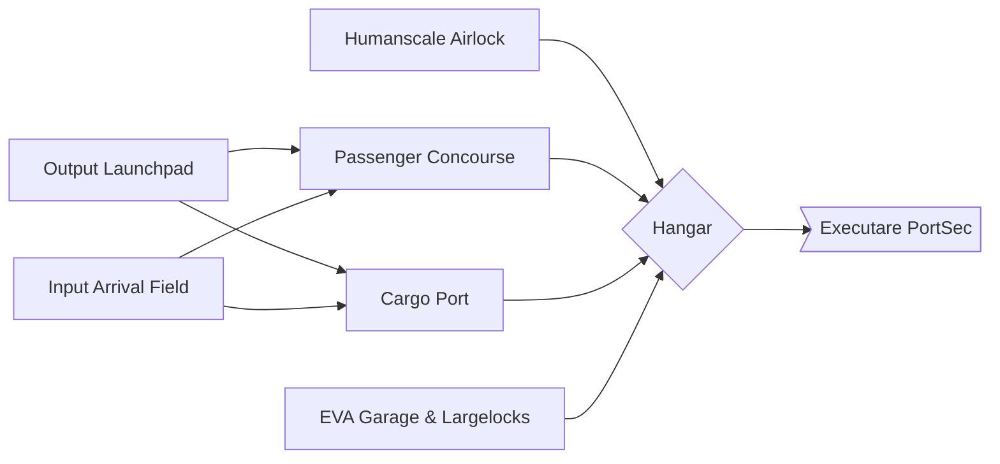

# Airlock, Docks, & Two Smoking EVAs

This is the first thing that you encounter on Paradise Lua. The entrance.

On their first time through Airlock & EVA, players are quickly ushered out and through, and don't get a chance to fully
explore it as much as they would like.

Even if they do return, the airlock has security safeguards out the actual wazoo: PortSec won't let them back out
to the Airlock, and even if they do, there are many systems in place to keep random citizens from walking out
into space.

## Passenger Concourse
Passengers and Cargo are both delivered to the station in nearly identical Containers.
The treatment of different categories of Container varies wildly, however.
Human Containers are treated with the second-highest level of care: collected from the
Input Arrival Field and delivered gently
to the Passenger Port where, after a pressure equalization step, passengers can
step out on to the concourse.

## Cargo Port
Many other containers flow back and forth through the station.

Things are at their busiest
after a fresh barge has landed, when containers are picked off of the
Input Arrival Field by EVA Cargo Trucks in order of their perishability, with humans obviously _first_.

## Output Launchpad
The Moon's escape velocity is a mere 8500 km/h, child's play compared to the 40,000 km/h required on Earth.

Getting cargo to that velocity is accomplished with a large magnetic railgun mounted next to Paradise Lua.

## Input Arrival Field
Large Container Barges land on the Input Arrival Field.

Before the Large Container Barges land, they shoot their Mass Driver at the Input Arrival Field,
offsetting large amounts of their incoming momentum to provide a softer landing. The Mass Driver hits
with an incredible amount of force - it would be incredibly loud if there was an atmosphere
 to carry the shockwave.

## Humanscale Airlock
This is just a door that leads out, to the Moon.

The Airlock always has a security detail, and the outer and inner doors require an Airlock Keycard to open,
or an Unlikely SCI check to hack the Keycard panel.

Thing is, there's no air on the Moon. (Citation needed.)

The way an airlock works is that there are two airtight doors: an outer door, and an inner door.

This limits the amount of air that can escape at any given time: so long as both doors
are never open at the same time, there's no path for air to directly escape.

But it's a little more complicated than that: rapid depressurization or repressurization can be
traumatic - it's hard on mechanical components, causes windows to fog up, and is no party for the
humans involved, either. So, transit through the airlock involves a hour-long wait while the
pressure inside the airlock aligns itself with the air pressure either inside or outside, and they

This depressurization step can be overridden with a Hard SCI check, although it's... not recommended,
except in an emergency. Check [The Moon: Going Outside Will Kill You](../../the_moon.md#going-outside-will-kill-you) for information
about what happens. (Hint: it bad.)

Sitting just outside of the Airlock are rows and rows of fully-charged EVA Suits, each in an individual locked closet.
Unlocking the closets requires an Airlock Keycard or a Hard SCI check.

## EVA Garage & Largelocks
Connected to the Hangar are the

## Hangar
An enormous, busy hangar with uniformed staff and cargo robots scuttling around.

## Executare PortSec

That's [this next page.](./police.md)