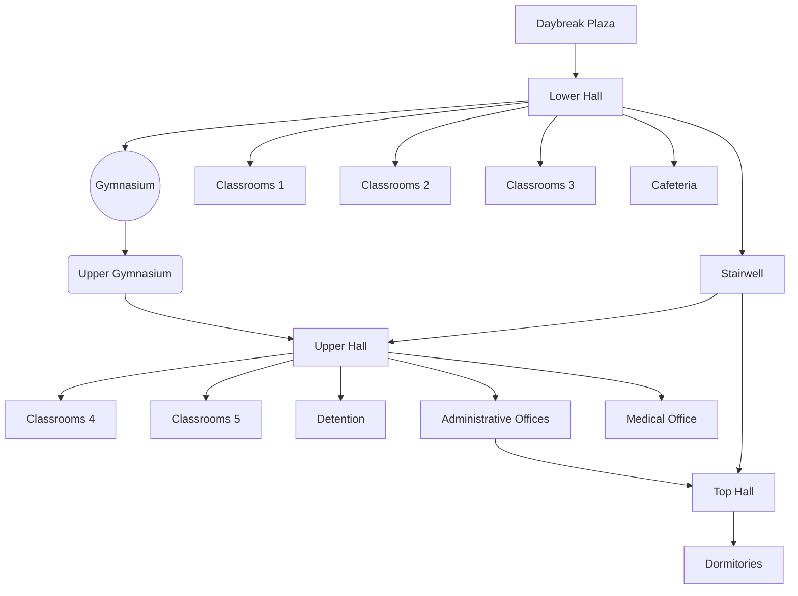

# The Daybreak Institute

**Five of Swords**

## Daybreak Plaza

## Lower Hall

## Gymnasium / Upper Gymnasium

## Classrooms

### Swords Classroom

### Cups Classroom

### Wands Classroom

### Pentacles Classroom

### Major Classroom

## Cafeteria

## Stairwell

## Upper Hall

## Administrative Offices

## Medical Office

## Top Hall

## Dormitories