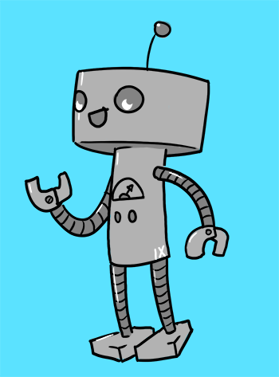

# EDD - Eddy

Eddy is not so much a chooseable, playable Major Arcana as they are a temporary, lightweight character, intended
for players who maybe only intend to stay for a single session, for players who've died and
would like to participate in the rest of the session as a temporary character,
for players who aren't excited by loads of tactical choices in battle,
for younger players, for less experienced players,
or for players who exceed the _recommended player count_ for RT: 0.

(_Having too many players can make turns drag on forever, so having a fifth or six player play as an Eddy can hopefully clear things up a bit._)

The GM is encouraged to print off a few [Eddy character sheets](/generated/printables/eddy.html) and tuck them away, for a rainy day.

Eddy is a friendly robot who bumbles along and helps out the players.

Eddies are little semi-autonomous, remote-controlled robots that pepper the station,
doing their best to help wherever they can.

Eddies can not operate outside of the station: their bodies are remote controlled and
actually fairly disposable - which is good, because the station is dangerous and Eddies
are not terribly smart.

Their initial digital imprint was built on an architecture that attempted to model the brain
of a 12-year old Golden Retriever named "Sunny", and it was remarkably successful: as a result,
the Eddies are unbelievably friendly, helpful, and self-sacrificing. They are also not
_that much_ smarter than a regular Golden Retriever with opposable thumbs and the ability to speak.

Eddy is a nickname: Eddy's full name is Ed25519, but they go by "Eddy" for short.

Eddies are sentient and cheerful. Each Eddy has a single primary function that they perform around
Paradise Lua - maybe "sweeping", "vacuuming", "repairing pipes", "lubricating doors" - something along
these lines. After choosing your Eddy's skill (see below: each Eddy gets one skill), you should determine
what your Eddy's job on Paradise Lua _is_.

Eddy is not the only "Eddy" - there are dozens of Eddy-class robots who might stop in and help the players out.

## Eddy Names:

* Ada (ADA 83)
* Al (ALGOL 68)
* Cal (Pascal/Intercal)
* Sim (SIMULA 67)
* Mod (MODULA 2)
* Phil (EIFFEL 65)
* Mac (HMAC)
* Ipey (IPAddr)
* Emdy (MD5)
* Sha (SHA-256)
* Nim
* Ruby
* Pearl (PERL)
* Julia
* Dylan
* See
* Sharp
* Dee
* Sequel (SQL)
* Lithp (Lisp)
* Rusty (Rust)
* Gogo (Go)

## Skills

Each Eddy can choose only one Skill. That Skill is related to the automated task they perform around Paradise Lua.

The Eddy can _only_ make checks for that Skill.

For example:

* An Eddy with FINAID might be responsible for watching a perimeter for security.
* An Eddy with DRAMA might be responsible for acting as an automated cashier in a convenience store.
* An Eddy with SCI might be a laboratory assistant.
* An Eddy with FREE might be a door lubricator/maintainer.
* An Eddy with GYM might be a duct cleaner.
* An Eddy with AID might be an auto-nurse.
* An Eddy with SHOP might be a constructor or fabricator.
* An Eddy with LAW might work as a clerk.
* An Eddy with MISC might be responsible for sorting screws by varying size, which has given it a lot of time to browse Luapedia.

## Shared Deck

You may not have enough extra tarot decks to support all Eddies: for this reason, none of their abilities are deck-modifying.

They can all share a deck, or if necessary, they can just draw cards from the DM deck.

## Combat

Combat scaling doesn't apply to Eddies: if there are 3 players and 2 Eddies, the combat should be designed for 3 players.

Eddies are nonthreatening and Adversaries won't target them unless no other targets are available.

Eddies have 20 Hit Points, like players do.

In every combat phase, Eddies go before players, draw a 3 card hand, and can play _only two cards out of the three_, discarding the other card.

### What Do They Do With Those Cards?

Check the [Eddy character sheet](/generated/printables/eddy.html).

## There's Always More Eddies

If an Eddy is destroyed (either in combat or as a result of poor decision making in a non-combat scene), an essentially
identical Eddy will roll up in the next scene (after the combat, or in the next room) and introduce themself to the players.

_"Hi, I'm Eddy 2!"_

_"Hi, I'm Eddy 3!"_
