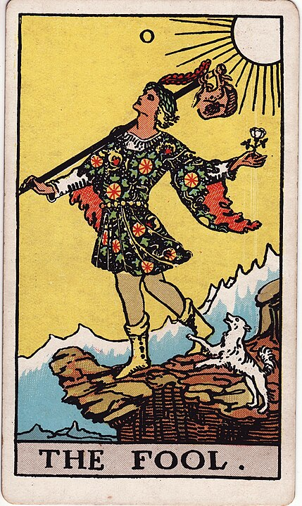

# The Fool

**New Beginnings, Naivete, Freedom, Recklessness, Gullibility, This Is What You Get For Trusting Apple Maps, Dumb Feather Hats**

No thoughts, head empty.

Look at this happy-go-lucky idiot!

He doesn't even see that he's about to fall off of a cliff!
He's not even looking where he's going.

He hasn't packed anything but, like, a small purse.

He's got a little dog trying to warn him that he's about to
tumble to his death, but who has time to listen to little dogs?

He's holding a white flower, which is symbolic of "innocence"
and also "not packing enough".

In some sense, though, he's brave: willing to stride headlong
into danger without even looking at where his feet are.

In a much more real sense, though, he's an idiot, who's
about to try and see if that flower works as a parachute.

Some people liken the Major Arcana of the Tarot to the
[Hero's Journey](https://en.wikipedia.org/wiki/Hero%27s_journey) - and, in that
sense, The Fool is _the hero_. The zero, the blank slate, the _adventurer_.