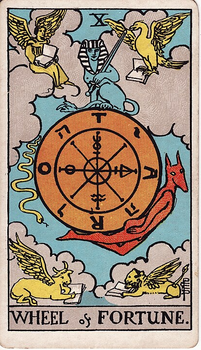

# 10 - Wheel of Fortune

**Fate, Luck, Coloring With Your Cool Animal Friends, Showing Off Your New Sword, Being Able To Support An Entire Cylinder With Only Your Incredibly Tight Buttcheeks, Pat Sajak**

The Wheel of Fortune means "random bullshit" and boy is this card ever covered in some random bullshit.

I've been mostly leaving out mention of the esoteric occult mythology while I talk about these cards, because
if you read too much about Kabbalah your brain starts to pour out of your ears: it's
sort of a syncretic mishmash of "judaism but with the rails taken off after taking a bunch of hallucinogens",
astrology, alchemy, and Aleister Crowley's sleep paralysis demons. The idea is, I think, if you pile enough
bad ideas together they start to look like a coherent worldview. (Any similarity to modern big-tent conspiracies
involving adrenochrome and pizza is at-best accidental.)

Anyways, that's how this incredibly simple card ended up loaded down with a pile of symbols from astrology,
hebrew characters, alchemical symbols, and a surprisingly thicc Anubis.

Trying to read any concrete meaning into that is a fool's game. This card is about one thing and one thing only:

Wheel!

Of!

Fortune!

The idea of the Wheel of Fortune,
the [Rota Fortunae](https://en.wikipedia.org/wiki/Rota_Fortunae),
goes back thousands of years, to the point where it was already a time-worn cliché
by Ancient Roman standards. King or peasant, whoever you are, you spend your life bound to the Wheel of Fortune:
sometimes you're up while other people are down. Sometimes you're down while other people are up, and the turns
happen entirely unpredictably.

tl;dr: Sometimes shit just happens randomly.