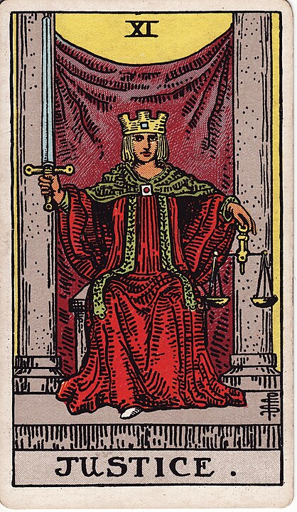

# 11 - Justice

**Justice!**

Some cards have a lot of interpretations. Justice is a simple one: JUSTICE!

It's also incredibly complicated, because _what is justice?_

Guess what, it's violence! Look at the sword that Justice has. That's not ornamental.

Deep inside your brain, in a dark place, there's a part that's been there for as long as people have existed:
people who cheat or do wrong need to see _consequences_. Everything must be _fair_.

There must be such as thing as karma: the smart version of chaos that doles out punishments.
That's a real thing, right?

The mob have killed your family, or your dog: the only reasonable recourse is a
[roaring rampage of revenge](https://tvtropes.org/pmwiki/pmwiki.php/Main/RoaringRampageOfRevenge).
This is Justice in the John Wick, The Bride, The Punisher sense: what has been taken
from you is immeasurable so what must be taken in return is endless.

The thing is, the desire for vengeance is... outsized, _hungry_. We desire consequences that
are way out of line with the original violation.
I know I've laid awake in my bed dreaming of finding the person who stole my bicycle and
hitting that person with a crowbar until they'd _need_ wheels.

Of course, violence only begets more violence: lots of people are _somebody_'s whole world,
so every John Wick creates ten more John Wicks in their Wick wake.

This is the cycle of violence: Person X, demanding vengeance, enacts violence on Person Y,
possibly doing collateral damage to Person Z, and now Person Y and Person Z are
out for their own vengeance, leading to an eternal cycle of violence. Hatfields and McCoys.
Montagues and Capulets. What's even worse is that sometimes Person Y didn't even _do_
whatever thing that got them justiced-upon in the first place.

If you're wondering 'why is vigilante justice a bad thing?', well, _this_ is why.

As a result of having to deal with the fallout from a few too many John Wick Scenarios,
thousands of years ago, society as a whole (and/or one cool Hammurabi dude) decided that
in order to keep every conflict from escalating wildly out of control,
an impartial third party should step in and dole out
a _reasonable amount of vengeance_. An eye for an eye. Reciprocal justice.

Thus the scales: for every harm done to you, an equivalent amount of harm must be done in turn.
It's only fair.

Some people believe in non-retributive justice: restorative justice. Forgiveness, rehabilitation.
Doing what's best for _society_. But that doesn't satisfy our lust for vengeance.

Jurisprudence is supposed to sound clinical, boring, legal, but at it's heart,
it is a tall frosty Big Gulp full of _violence_.

When you get to the bottom of the Big Gulp, there's only one thing left. _Just ice_.