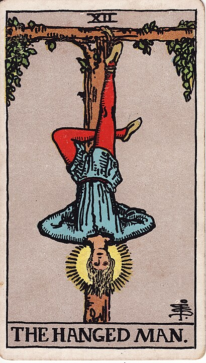

# 12 - The Hanged Man

**A Different Perspective, Getting Stuck, I Woke Up Like This, It's Not As Bad As It Looks**

With a name like "The Hanged Man", this card sounds _way worse than it is_.

Maybe this card should have picked a slightly less violent term: it would be
exactly as effective as "The Upside-Down Man" without immediately bringing
to mind a _hanging_.

See, The Hanged Man is here of his own volition. He's simply looking at everything
a completely different way as everyone else. What does he see that you don't see?

He's also not going anywhere, fast.