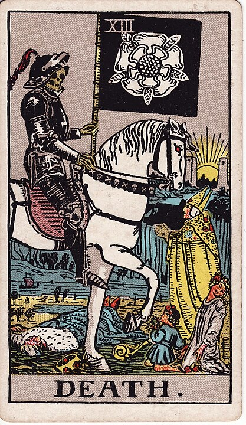

# 13 - Death

**Death.**

The interpretation of this one is as plain as the image on the card.
The Lovers means _love_. Death means _death_.

Remember [when I described how cold reading worked?](../card_index.md)
"DEATH" provides an immediate punch, it's bold, it's a big prediction,
but it's actually a lot more generic than it seems. The only things in life that are certain
are death and taxes, after all. Most people have had some kind of experience with death,
so this card is going to be _broadly relevant to a lot of people_ while still feeling
_utterly magical_ when you draw it a day before your cat Mr. Mittens shuffles off his mortal coil.
 Thing is, though, if it doesn't come through and nobody dies
or has died recently, the fortuneteller needs an _out_,
which is why Death could also mean "any transition", or "letting go".

This is **premium-grade soothsayer horseshit**. Death means _death_.

It's a horseman in black standing over a dead guy. I'm not sure else how you want me to interpret this.
That rich guy isn't begging to avoid a _transition in life circumstances_. He's trying to cheat death,
and _it's not going to work_.

Losing a loved one is among the worst things that will definitely happen to most of us.
Being able to love, at all, in the face of the unavoidable bit at the end, where it ends,
takes [Strength](./8_strength.md).

Grief, as they say, is just love with no place to go.

Religious types have spent decades promoting memento mori: reminders of death,
because their particular swindle: the promise of eternal life
(and a perfect post-mortem karmic retribution system, to boot),
works _best_ when you're devastated at the loss of a loved one or
staring down your own fear of death.

To be honest, I used to be much more strident and unpleasant an atheist
before I realized to what extent people _need religion_ to be able to function,
at all. Sure, it's delusional, but that delusion is _helping_, and attempting
to take it away from people is an _act of unimaginable, unthinkable cruelty_.
If you ever find yourself wanting to be snide about someone's belief in an
afterlife, just take a moment and imagine that they are comforted by the idea
 that their lost family members are waiting for them there, and what it would cost them to lose that.

Death is, in no small sense, utterly terrifying. We know, intuitively,
 what it is like not to exist: the time before we were born gave us a hint as to what
 an eternity of nonexistence is like. Despite that, it's tough to really describe
 the experience because we weren't around to experience it.

It's not "nothing", because even "nothing" is a thing, a concept, that demands a frame of reference
_from which to experience the nothing_. The best analogy for it in writing that I can think of
is simply to leave a sentence half comple

Restful sleep provides a hint, too: it's not
a _place where we are_, it's an _absence, where we aren't_. There's no suffering, no
joy, no... anything - which would be awfully boring if we were there to experience it,
which we weren't and won't be.

Somehow even worse, the universe that we exist in stares at exactly the same void at the
end of its existence. Not only will we eventually not exist, so too will _everything else_.
Not even two vast and trunkless legs of stone, standing in the desert.
In the absence of the ability to percieve time-frames that comes with no longer existing,
our own deaths are not meaningfully distinguishable, from our point of view,
from the end of the universe and all things.

If we spend an infinite stretch of time not existing, add to it a few brief moments of "whoa, here I am", and
then spend another infinite stretch after that not existing once again, can we even be said
to meaningfully exist at all?

René Descartes is in a tavern. He is drunk. The bartender cautions: “Monsieur, I think that you have had enough.”
Descartes slurs back “I think not” and vanishes.

It's grim, and thinking about it too much leads down the road of utter, bitter nihilism.

There's an upside, though: it's the opposite of the memento mori. Oblivisci mori. You can
simply forget to die. You will probably still die (citation needed), but you can deal with it when it happens:
and you know what? You won't have to think about it much, _then_, either.

The cure for nihilism, or at least the best one I've been able to concoct without
the pleasant salve of promises of eternal life, is just _not to think about it too hard_.
No time to ponder the heat death of the universe: you need to get some eggs.

This can be tough if you're a plotter, a planner, a tactician,
used to applying a long-term viewpoint to all of your thinking. Sometimes you have
to acknowledge that the _only_ time is _now_. Be petty. Be small. Get mad about something stupid.
Have some toast. You only live once, so be careful, but you only live once, so you might
as well enjoy it.
