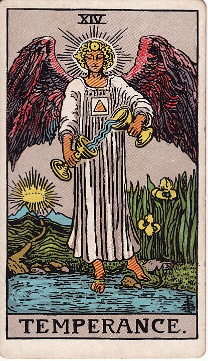

# 14 - Temperance

**Balance, Moderation, Boundless Chill, The Golden Mean Fallacy, And He Mixes A Pretty Solid Martini**

Temperance should be a bartender. Here's why I think it's funny: bartenders have a
sort of cultural assocation with the idea of a neutral, relaxed bystander who will
listen to your
stories while casually wiping down a glass - this is rarely the case in _reality_,
but it certainly has developed as a [narrative trope](https://tvtropes.org/pmwiki/pmwiki.php/Main/TheBartender).
However, "temperance" is also
a movement that started by trying to discourage folks from drinking too much and
ended up growing into a movement calling for complete abstinence from drinking,
which actually _isn't a very good example of temperance_. Temperance is about
_balance_, not absolutes.

There's no card for Abstinence, because (checks notes) that would be lame.

Anyways, that's kinda given Temperance the impression of being the virtue of
being a wet blanket, when - at worst, they're just being practical.
Temperance can drink alcohol, but Temperance drinks water, too, so that they don't
get a nasty hangover the next day, and they only have a glass or two.
That's good for today. Life is a marathon, not a sprint.

Temperance can get a little wild at parties, because they respect that even
moderation must be enjoyed in moderation, but most days they don't drink at all.

Temperance eats a lot of vegetables. Temperance has a gym
membership. Temperance washes the bedsheets with the laundry.
Temperence pays their bills on time.
Temperance has their shit together. Temperance is a goddamn adult.
