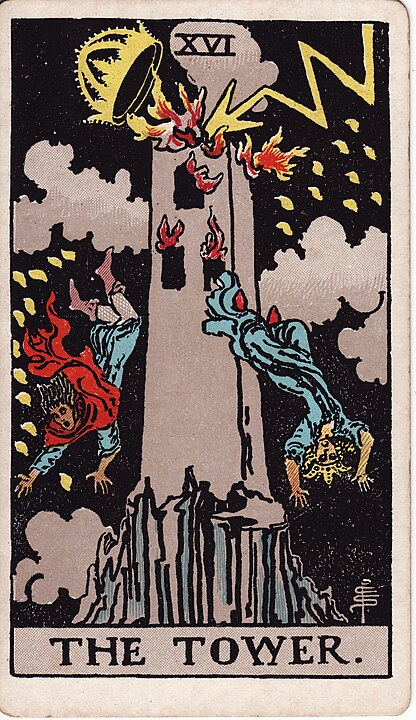

# 16 - The Tower

**Disaster, Hubris**

[Death](./13_death.md) is bad, of course, but it's both inevitable and final. It doesn't
capture the full spectrum of possible human catastrophe. For everything else, there's
the Tower, a more general symbol of "oh, shit". It's a real Critical Fail of a card.

Statistically, _someone_ must have drawn this card in a reading on September 10, 2001,
and then just had the wierdest day, afterwards. I bet they're very convinced of the
efficacy of Tarot readings.

While "shit hits fan in a big way" is the primary meaning of this card, it's intended
to be a depiction of the Tower of Babel, somewhat, and so the card takes on the second
meaning: hubris, struck down. The Tower was too tall, it never should have been built,
and now this folly is collapsing back down to Earth.

This is a stock market crash card, a Titanic sinking card.