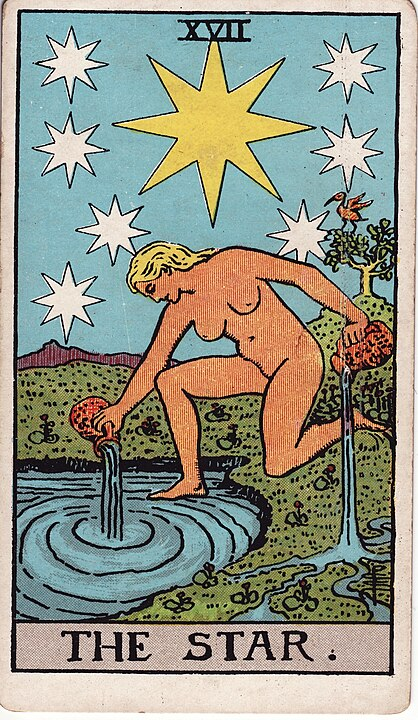

# 17 - The Star

**Narcissism, Vanity**

I'm going to go out on a limb and say that this card is, in my opinion, one of the most
commonly misinterpreted in the Tarot.

"Look at that woman watering the grass right next to a pond, this card means healing and
renewal."

Nah, man, she's watering _the pond_. Ponds don't need water.
That woman is just utterly obsessed with her own reflection. She can't even keep
her pot of water straight.
She might be the only person in the universe for all she knows.

Despite her self-absorption, she's extremely invested in how everybody sees her.

Anyways, she deserves to be the center of attention: she is a Star.
