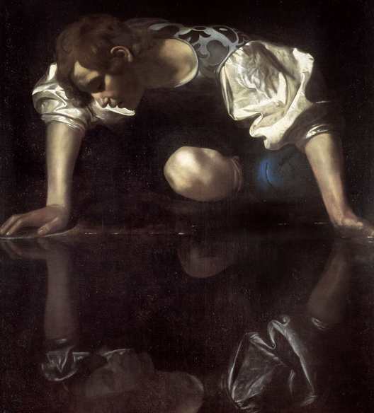

# 17 - The Star

**Narcissism, Vanity, Missing Out On The Northern Lights And Cool Birds Because You're Staring At Your Own Reflection**

I'm going to go out on a limb and say that this card is, in my opinion, one of the most
commonly misinterpreted in the Tarot.

"Look at that woman watering the grass right next to a pond, this card means healing and
renewal and hope and bounty." Uh, that territory is already covered by The Empress, thanks.

She's watering _the pond_. Ponds (checks notes) don't need water.

Do you know where I've seen this imagery before?

That woman is just utterly obsessed with her own reflection.
There's some kind of gigantic supernova happening behind her and she's just _staring at her own face_.
So much so that she's dumping valuable water all over the place.
She might be the only person in the universe for all she knows.

Anyways, she deserves to be the center of attention: she is a Star.
