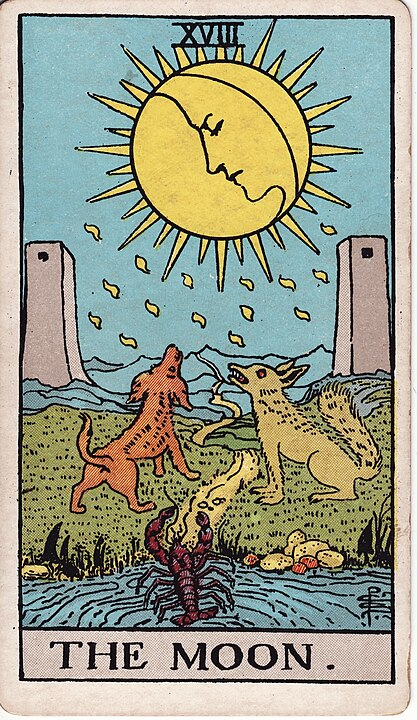
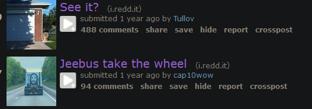

# 18 - The Moon

**Mirror Images, Illusions, Apophenia, Lies, Fear, Anxiety**

I know that a crawfish just _hanging out_ makes **me* anxious.

I guess the interpretation is that one of these two dogs,
and one of these two towers - isn't real at all. Maybe also the
crayfish. Maybe the various barriers on this pathway are just made up.

This is the card of seeing patterns where patterns do not exist.

Do you see a face in the moon? That's [pareidolia](https://en.wikipedia.org/wiki/Pareidolia), the
tendency to see faces everywhere. Because we see ... faces. Everywhere.

Pareidolia is one kind of [apophenia](https://en.wikipedia.org/wiki/Apophenia): the tendency to see
patterns where patterns don't actually exist.

Pareidolia and apophenia are natural: we are wired to see faces and discover patterns.
It's only schizophrenics and people who have taken hallicinogenic drugs who start to suffer from apophenia gone wild.
Suddenly, _everything is connected_.

In fact, there are some systems intentionally and maliciously arranged to take advantage of that tendency in our brains:
broad systems filled with many interlocking layers of meaning that teach you to find
patterns everywhere, even when they don't exist.

It doesn't matter if the layers
of meaning actually _mean_ anything, and in many cases in order for the systems to work at all,
the layers can't mean anything. That's the magic behind the Rider-Waite Tarot: eccentric mysticism,
astrology, alchemy, numerology, they're all disproven nonsense from a bygone era, but by layering them together in a
language of symbols they provide the illusion of meaning where none exists.

This fertile ground of interconnected but ultimately meaningless concepts allows talented hucksters
like myself to project any meaning they so choose upon the cards.

Conspiracies, cults, and fortunetellers have a lot in common in this sense: a charismatic stranger
looking to empty your wallet promises to open your third eye by showing you patterns you could
never have seen on your own; inducing a kind of artificial apophenia in you.