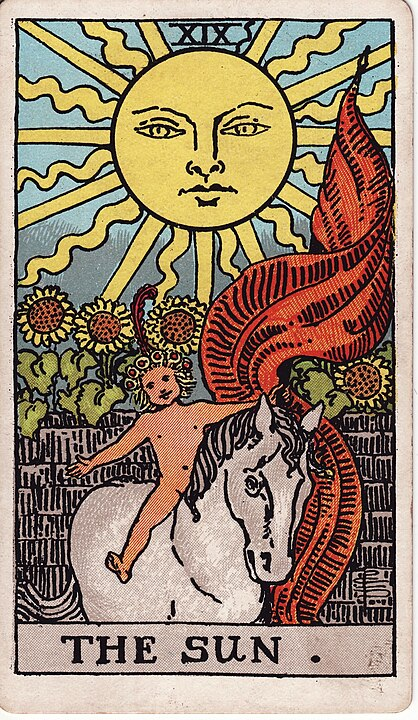

# 19 - The Sun

**Optimism, Truth, Light, Naked Horse Rides**

Things got a little grim while I was talking about [The Moon](./18_the_moon.md), huh?

If you pull on the thread of "everything is just patterns that people made up" you
start to go a little barmy. The economy, the legal system, our jobs, fame, finance and fashion,
 it's all just a game and we've been making up the rules as we go along.

It's time for a beach day. The sun's real. The way the sun feels on your skin is real.
A picnic lunch is real. Alcohol is real. Relationships are real. Happiness is _real_.
Go outside. Touch grass. Eat.
