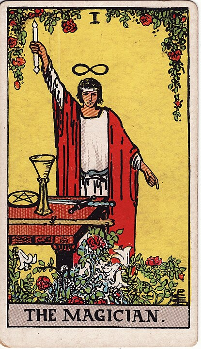

# 1 - The Magician

**Resourceful, Mastermind, Manipulator, Skillful, Yard Sale, Who Wants to Buy a Double-Ended Buttplug, Infinity-Brain, Also A Solid Gardener**

Now this is a Magician who's got his ducks in a row. He's _staying alive_.

Look at that, the Magician has got all four of the Minor Arcana symbols just sitting there.
On the table. They either have a complicated plan or something to sell you.

With their ouroborous belt, the infinity symbol above their head, and a full
table of weird ass crap they found, The Magician is ready to will their plans
into fruition, with _tools_ and _schemes_.