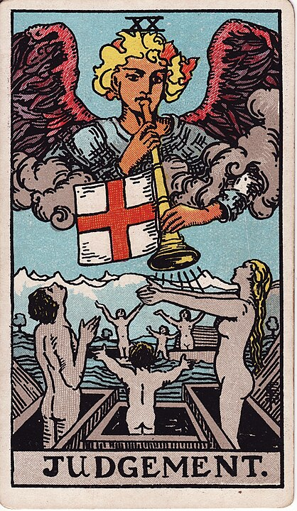

# 20 - Judgement

**A Great Reckoning, Rapture, The Final Chapter**

An enormous percentage of the world's population subscribes to one
religion or another that calls for a Great Reckoning of some kind.

Even Flat Earthers believe in the day, some small amount of time in the
future, when everybody finally comes around and realizes that the
Earth has been flat the whole time and that they were right, all along.

One of the more humorous ones is the online cult of folks who've been
snookered into buying Gamestop shares at many times their face value,
who now believe in a vast and mythical market correction
_day of reckoning_ that will render all money on the planet moot while
making them rich beyond their wildest dreams.

The promise of "this will all turn around in our favor, not long from now",
is extremely common in cults of all stripes.

It's again important to note that behind the Rider-Waite Tarot and
its mishmash of gnostic nonsense and occult bugaboos, lies
the [Tarot of Marseilles](https://en.wikipedia.org/wiki/Tarot_of_Marseilles),
a deck of playing cards used by French Catholics: what this card
depicts is _judgement day_.

At some point in the future, God himself, so the theology has it,
 is going to come down, fold up the gameboard and toss all of his pieces
back into the box.

Like with most any weird cult reckonings, the date that this is going
to happen is always _not long, now_. Even after thousands of years,
the apocalypse is _always just a handful of months away_.

I can't imagine the effect on long-term decision making it has to
assume that everything is going to wrap itself up neatly, on its own,
within our lifetimes. I'd think we should check if people believe
that before we let them hold public office.

So Judgement is "The End". The final boss. The high muckamuck. The climax.
It's time for the story to wrap up and for all of the loose-ends
to get tied up, before we put all of the pieces back into the box,
and if we're going to feel like we got the most out of this experience,
we want to see a _grand finale_ to really cap it off.
