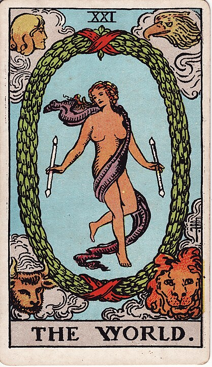

# 21 - The World

**Completeness, Achievement, Wholeness, Denouement**

That's it! You did it!

You reached the end! You defeated the final boss!

You watched the credits! You found the monster at the end of this book!

There's a sense of emptiness to it, a whole vibrant world disappearing
before your eyes. Maybe there will be a sequel, maybe you can go back - but it'll
never be the same as your first time.

I hate this part most of all. Even a good story has to come to an end eventually,
and the better the story the harder it is to go back to The World.

The cycle, however, continues: maybe not with this story, but with another,
and every pass through you grow and evolve.