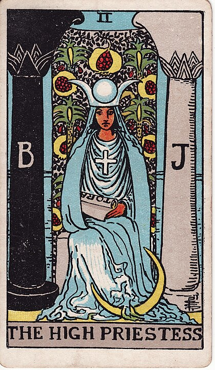

## The High Priestess

**Intuition, Them/They, Mystery, A Huge Number Two, Great BJ Game, Bringing Your Crescent Moon With You Wherever You Go**

Sitting between yin and yang, black and white, and two huge-ass pillars is The High Priestess.

A representative of the middle ground between two extremes, The High Priestess is the card of enby bisexual energy,
but ultimately The High Priestess _did_ come to work dressed like a clitoris so take that with a grain of salt.

The interpretation of female anatomy as both sacred, mysterious, and utterly beyond the
realm of understanding does not speak well of mystic A.E. Waite's sexual prowess.

The iconography of the High Priestess card parallels that of the iconography on [The Hierophant](./5_the_hierophant.md).
On the cards the [Rider Waite Tarot were based on](https://en.wikipedia.org/wiki/Tarot_of_Marseilles),
the High Priestess and Hierophant were the "Pope" and "Popess" respectively.

"Popess" is a strange thing. There have been lots of male popes, some might say "all of them." - although
there is the story (extremely apocryphal) of [Pope Joan](https://en.wikipedia.org/wiki/Pope_Joan), a woman
in the 800s who fooled people into letting her Pope it up for 2 full years before ruining the game by having a
baby. Some people say that _this is the reason_ that every new Pope is now ritually punched square in the stomach
on his Pope Inauguration Day. _(ed: my Catholicism is a little rusty, [ping me if I got this wrong](https://mastodon.social/@cube_drone).)_
