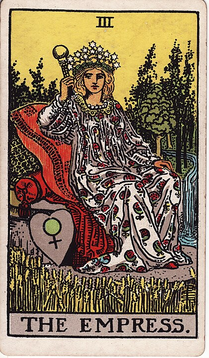

## The Empress

**Femininity, Motherhood, Beauty, Harvest, Nature, Pondering Her Orb, Too Much Hat Game**

I'm pretty sure she stole the pomegranate sheet behind The High Priestess and turned it
in to a dress.

(I believe that) Femininity is a cultural construct rather than a _real thing that exists_.
The Empress is built out of all of the stuff in the bucket marked "girl", good or bad.
That doesn't necessarily mean "biologically female" but it certainly means "culturally female" for all that entails: she's soft, she's hot, she's motherly, she's nurturing, and she's brought entirely too much luggage into the forest with her.

Gaslight, gatekeep, girlboss.
