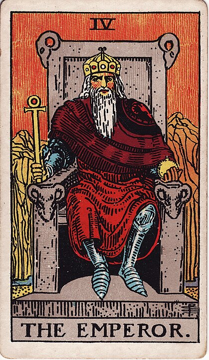

# 4 - The Emperor

**Masculinity, He/Him, Fatherhood, Violence, Authority, Pragmatism, Reliability, Stoicism, Side-Eye, The Holy Hand Grenade of Antioch, Uncomfortable Chairs**

Before you come at me for enforcing rigid gender roles, let me explain: the deck is more than a hundred years old.
So femininity is portrayed as nurturing and nature-oriented and motherly, and masculinity is ramrod stiff, authoritarian, and militaristic.

Where the Empress appears to comfortably and effortlessly manage her pleasant forest kingdom with kindness and bounty,
the Emperor is a bastard-coated bastard ruling a harsh, unpleasant mountain range with an iron fist.
He's old, and shrewd, and seems more than a little worried that he might have forgotten to oppress someone.

This is the card of masculinity, good and bad.

At his worst: He is violent, emotionally inaccessible, angry, entitled, and nihilistic. His favorite movies are Fight Club and The Joker,
he can't stop listening to Nu-Metal, and he owns a _lot_ of guns. He's straight-piped his Hummer.
He's got a leather jacket because when he grew up that was peak badass.
He tells women to smile more.
He's currently active in a group of men who promise to return things to the Good Old Days, when Men were Men.
He cannot imagine anything more embarassing than being made to look feminine, or weak.
He's become obsessed with military history and UFC on pay-per-view.
He's quick to mock people when they're not meeting his standards. His default greeting is the sack tap.
He says "you look better without make-up" to women who are wearing too much make-up and "are you tired, or sick?" to women who aren't wearing enough.
He's on his third wife (women are crazy bitches, anyways).
He's decided that masculinity means being wasteful and self-destructive, so he mocks salads and bicycles and
is just a little bit proud of the massive coronary he's been carefully nurturing for the past 18 years.
He's cried, just the once (when his mother died), and never again.

At his best: He is stoic, compassionate, responsible, reliable, protective, self-sacrificing, and a little goofy. He's had to fix the old Ford Ranger
more times than he can count, but he's invested in its reliability. He builds bird-houses.
He will teach you how to shave.
He turns down the thermostat and tells you to put a sweater on if you're cold.
He's not the best player on his baseball team but he always gives 110% because it's important to him.
He washes the recycling before he puts it out so that it doesn't attract bears, changes all of the filters in the house,
and knows how to fix a flat tire. He didn't want a pet, because it hurt him so badly when he lost the last one, but now that there's a pet in the
house they're best friends. He has shorts that he likes because they're comfortable and he's not afraid to
embarrass himself by trying something new.
He wants to know how your day went. He wants to show you how to defend yourself against the class bully.
He cracks stupid jokes to cheer you up,
listens to rock & roll on a cassette player he's had since 1987, and always has your back, no matter what.