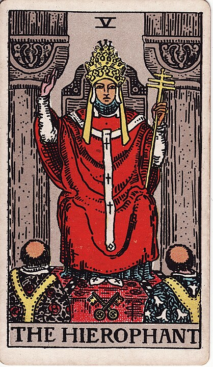

# 5 - The Hierophant

**Tradition, Conformity, Knowledge, Teaching, Perhaps The Most Impressive Hat So Far, Finger Guns, Two In The Pink, A Backscratcher I Found At A Flea Market**

I know what you're thinking. What in the hell is a hierophant?

According to Wikipedia, it's a "person who brings people into the presence of the holy".

There was a time when Tarot cards were just _playing cards_ with a lot of baked-in trump cards for trick-taking games (a tradition I'm hoping to bring back here) - and since they were playing cards from Europe, one of the trump cards was just _The Pope_. Can't beat The Pope.

That's much too Catholic for _occult mysticism_ so The Pope is replaced with this generic-brand Pope-like character, meant to represent any preacher or teacher. You're not fooling me, though, he's surrounded by dudes with the Friar Tuck haircut, this is just a dollar store Pope!

Anyways, The Hierophant is meant to represent institutional knowledge. Note the card's many similarities with its graphical parallel, The High Priestess: Whereas The High Priestess is intuitive, flexible, and mysterious, The Hierophant is institutional, inflexible, and mired in tradition. If that sounds critical of The Hierophant, keep in mind that The Hierophant is also quite a bit more likely to be _right_, and The High Priestess is quite a bit more likely to try and sell you a subscription to a crystal smoothie cleanse.

For what it's worth, The Hierophant is both the card for the Catholic Church and Modern Science,
so "institutional knowledge" can go in a pretty variable set of directions, here.
I suppose it depends on the institution!
