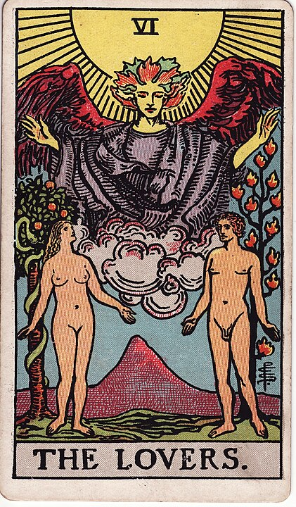

# 6 - The Lovers

**Love (Actually), Relationships, Asking Your Partner If They Would Consider an Open Relationship With a 12 Foot Tall Angel, Nude Chilling Park, The Garden of Eden**

This one's pretty easy. Love, dummy!

Not lust. The express-train to bone-town is more accurately expressed by The Devil.
This is a gentler, "draw a picture of their face in your high school notebook" love.

I guess one important distinction is that this doesn't have to necessarily represent romantic love.
It often does, but it can zoom out to mean close interpersonal bonds of any kind.