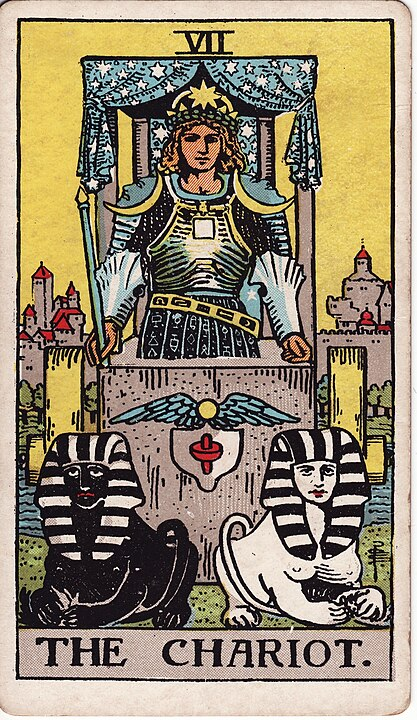

# 7 - The Chariot

**Focus, Ambition, Determination, Success, Square Your Chest, Moon-Shoulders McGee, An Eye-Roll From The Black Sphinx, Straight Up Just Not Having Legs, I Don't Think Chariots Are Supposed To Look Like That**

These sphinxes want to go in two totally different directions.
If the Chariot wants to go anywhere, they're gonna have to prioritize and direct.

The Chariot is a grindset, girlboss, day-trading, LinkedIn hustle-dork. Follow them for 38 great
tips to get more out of your day. Dollar-sign emoji, hashtag inspirational. They are either involved
in a ponzi scheme or some kind of pyramid-shaped multi-level marketing.

`#followYourDreams`

Both The Magician and The Chariot are cards indicating problem solving through force of will: the difference is that the Magician is
accomplishing these things through skill, tools, and plans, whereas the Chariot is clearly in more of a management role.

Leadership - not in the paternalistic and violent way of the Emperor, necessarily, but more in the manner of the supervisor
of a small fast food chain: driven, focused, and calling you at 2AM to find out if you will cover Madison's shift.

It's also important to note that without other folks to do all of the actual work, The Chariot cannot move an inch.