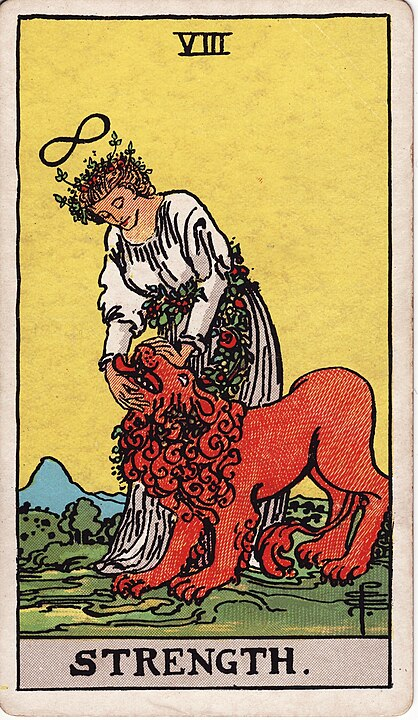

# 8 - Strength

**Courage, Bravery, Compassion, Resilience, Pet Ownership**

This is a fun one to describe, because a lot of people think it's strange that Strength as a woman patting
a lion on the head.

Perhaps one might imagine Strength to be an impossibly buff dude stackin' weights and getting yoked: but nay!

It's just this lady giving a friendly lion a nice chin scratch. _Who's a good boy?_

That's the message, here: that strength doesn't mean raw physical strength, but strength of character,
strength of resolve. She's not wearing armor, she's not afraid of the lion, she's in control of the situation.

She's not invulnerable: she's not hiding her vulnerability. She's wearing a soft cloth dress, not armor.
She's simply willing to own her vulnerability, to look past it, and to
go scratch the lion's chin anyways. [Courage is not the absence of fear, but rather the
assessment that something else is more important than fear](https://www.goodreads.com/quotes/172689-courage-is-not-the-absence-of-fear-but-rather-the).

Forming a relationship with an animal is also one of the things that requires the _most_ strength:
it's hard to fall in love with something that has a lifespan
that is so much shorter than ours. We must brace ourselves from the very beginning for the inevitable
heartbreak of losing one of our closest friends. Forming close relationships knowing full well
that the heartbreak of their loss is _inevitable_ - that takes **true** courage.

This is what Strength is: staring at the void, staring at _pain_, and saying "no". Not today.
Today we find a sunny place and give our lion friend a chin scratch.