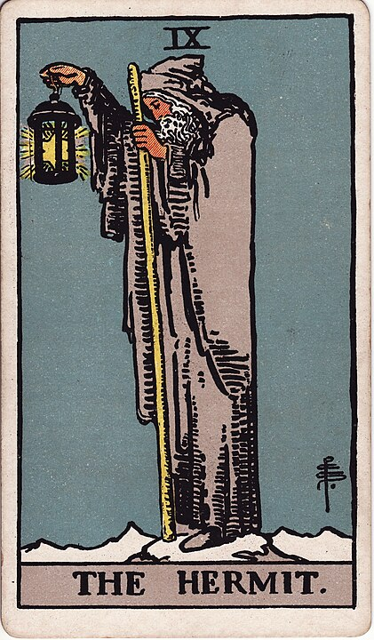

# 9 - The Hermit

**Introspection, Introversion, Solitude, Loneliness, Keeping Your Star Safely Contained, Beard**

The Hermit has gone somewhere, been alone for a long time, and returned with wisdom.

The Hermit exists in contrast with The Chariot: the Chariot drives, prioritizes, manages, and is utterly
useless without others to carry them. The Hermit is self-directed and totally free: able to go
anywhere and do anything. Chariot: extrovert, Hermit: introvert.

I think it's a misconception among extroverted folks that introverts don't like social contact. Introverts
need social contact as much as the next person: it's a basic human need, as present as hunger or thirst.
For introverts it's just that the social mask that they put up around others is more exhausting to maintain
than it is for others. After a social occasion they will come home, snuggle their cat, and decompress and
de-stress, temporarily freed from the exhausting procedure of pretending to be the person who other
people see them as.

The other contrast is with The Lovers: they exist totally and wholly within their relationship, growing
around one another in a co-dependent loop, whereas The Hermit is a strong, independent [ace/aro icon](https://en.wikipedia.org/wiki/Aromanticism)
who don't need no man.

We define ourselves partially by and through our relationships to others: losing our social network, or losing nodes
in our social network, is traumatic and difficult. [Solitary confinement](https://en.wikipedia.org/wiki/Solitary_confinement)
is considered psychological torture by the UN,
and can induce anxiety, depression, hallucinations, obsessions, paranoia, and psychosis. People who choose voluntarily to
seek out total and complete solitude are often considered _unusual_: but the ability to
define oneself _outside of relationships to others_, finding joy and meaning in self-direction, that's
a muscle, too, a skill that people can develop. The ability to be _able_ to take shelter in one's own skin, to
retreat, to introspect, these are vital to our development.

[So dance 'til you stop - 'til you wanna go home.](https://www.youtube.com/watch?v=T5s2OTqDiyo&list=RDR3OhI6p-6E4&index=5)