# Cups
Cups are the suit of emotions, feelings, and love.

## Ace of Cups - Emotions

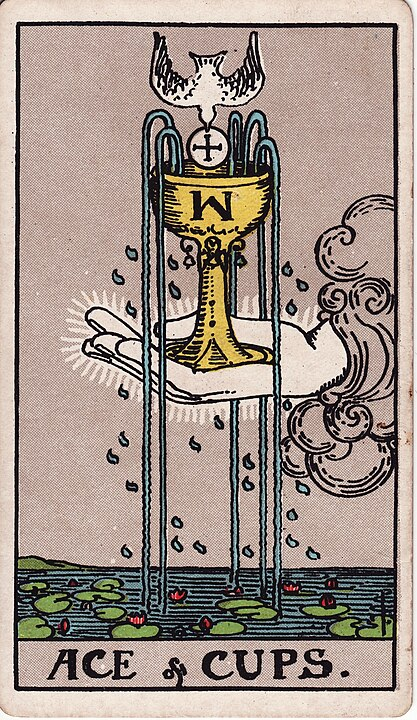

Out of all of the cups, this is the cuppiest cup.
Overflowing with emotion. There's so much.
Maybe it's a good emotion, like love.
Maybe it's a bad emotion, like love for cheese.

## Two of Cups - Partners

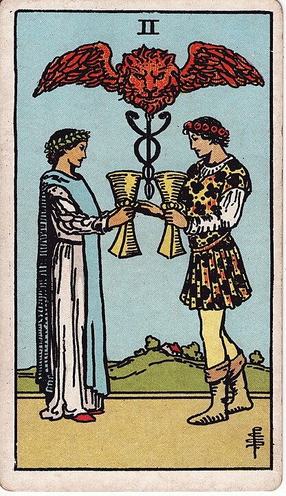

I can't help but think of doctors when I see a coiled snake like that.
These two have a solid rapport.

## Three of Cups - Shots shots shots shots

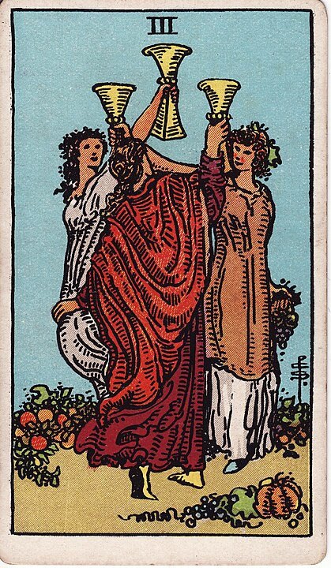

Getting crunked with your friends!

## Four of Cups - Careful

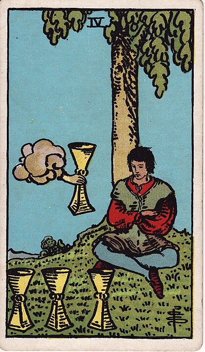

"No, bad idea cloud, I would NOT like a full glass of high-proof alcohol."

## Five of Cups - Regret

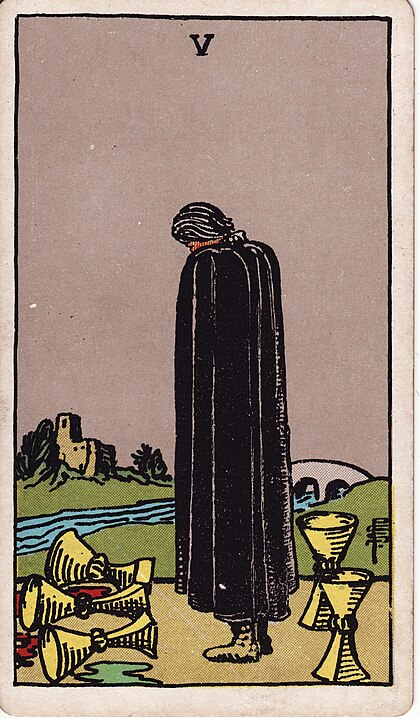

They made the mistake of listening to bad idea cloud, and things got dark.

## Six of Cups - Nostalgia

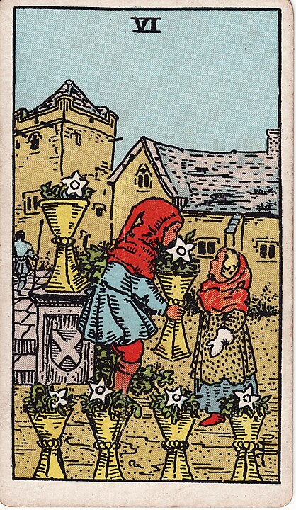

Innocence, joy, and remembering those times fondly.

## Seven of Cups - Advertising!

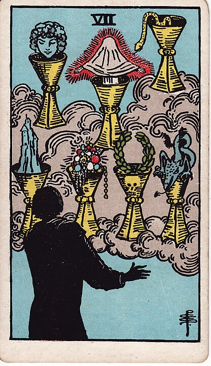

Whoa, look at all that cool stuff I could own!

## Eight of Cups - Abandonment

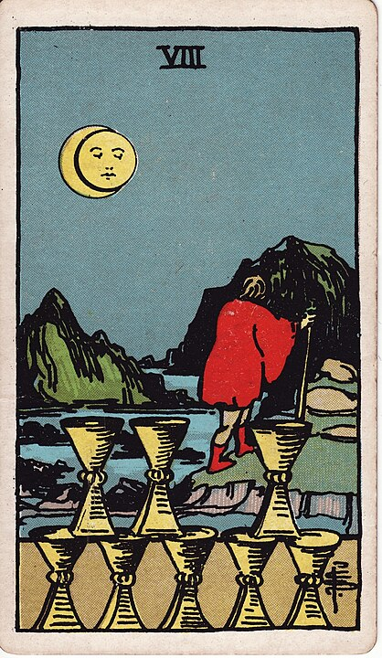

The credit card statement from all of that cool stuff has arrived,
the joy was short-lived,
and now it's time to bail, run off into the mountains, and hope they never find you.

## Nine of Cups - Contentment

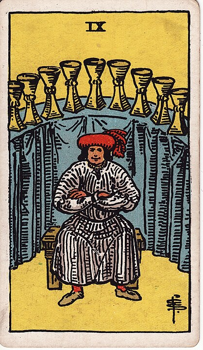

I don't need anything. I'm content with what I've got.

Check it. Check all these sweet cups. I've got cups for days.

## Ten of Cups - The Happy Ending

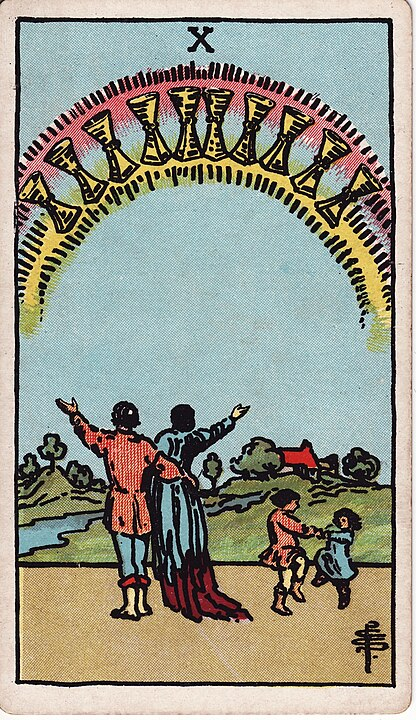

This is your picture perfect happy ending. A family, kids, a home, a _rainbow_.
It's perfect.

## Page of Cups - The Conman

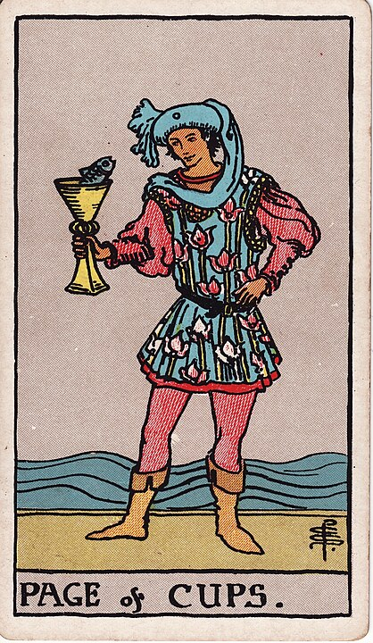

Me and my fish know what's up. This slick double-dealer always has an angle.

## Knight of Cups - The Knight of Love

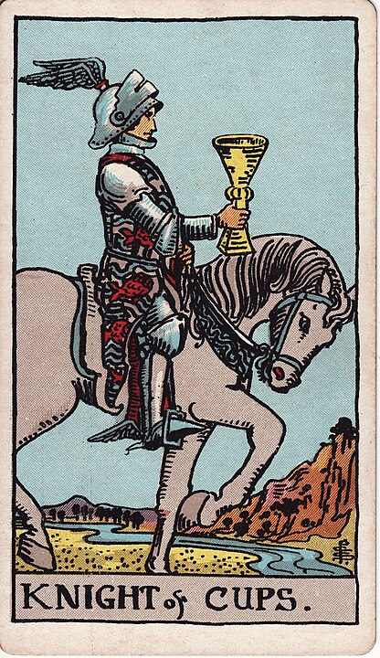

Calm, cool, collected, and putting it all on the line for someone he loves.

## Queen of Cups - The Psychiatrist

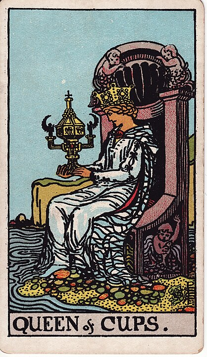

Emotional stability.

Will serve a cup of tea and help you work through your complex emotions.

## King of Cups - The Diplomat

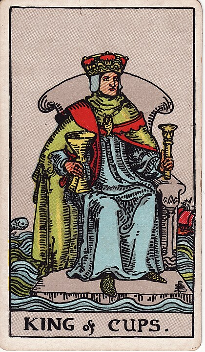

It's abundantly clear looking at this card that the King of Cups has just shat his pants and doesn't want anybody to know about it.

He's a deft politician, thoughtful and able to shift his position on a dime.