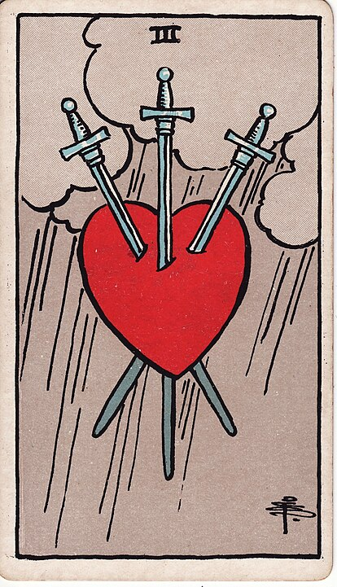

# Swords
Swords are the suit of power - ideas and conflict. And swords! Stab stab!

## Ace of Swords - Thought

New ideas, breakthroughs, clarity, success.

## Two of Swords - Decisions

A difficult decision or stalemate. Very Justice-coded.
To be honest it's kind of like having a whole second "Justice" card in the deck,
but this one isn't as jurisprudence-coded.

## Three of Swords - Heartbreak

It's literally a heart that's broken while rain happens in the background.
This is heartbreak & grief.

## Four of Swords - Sleep

Peace, rest & relaxation.
Sure, he's dead, but he's pretty relaxed about it.

## Five of Swords - Fight

Conflict, competition, & hurt feelings. "Ha ha! I've won all these swords, fair and square!"

## Six of Swords - Travel

Taking your freshly acquired swords for a nice boat ride. Transition, change, rites of passage.

## Seven of Swords - Deception

"Ha ha, I can't believe I got away with all that guy's swords."

## Eight of Swords - Prison

"The swords are back for vengeance!" Self-imposed restrictions, being trapped.

## Nine of Swords - Nightmares

"Oh god I wish I hadn't stolen all these swords." Anxiety, Fear, Concern.

## Ten of Swords - Trauma

The swords finally get their comeuppance. Painful Endings, Deep Wounds, Crisis.

## Page of Swords - Exploration.

New ideas, curiosity, all talk and no action.

## Knight of Swords - ADHD

Ambitious, action-oriented, driven to succeed, restless.

## Queen of Swords - Journalist

Direct, clear, independent communication.
She's a perfect journalist motivated only by her desire to find The Truth and put it in print.

## King of Swords - Mastermind

Mental clarity, intellectual power, manipulation.