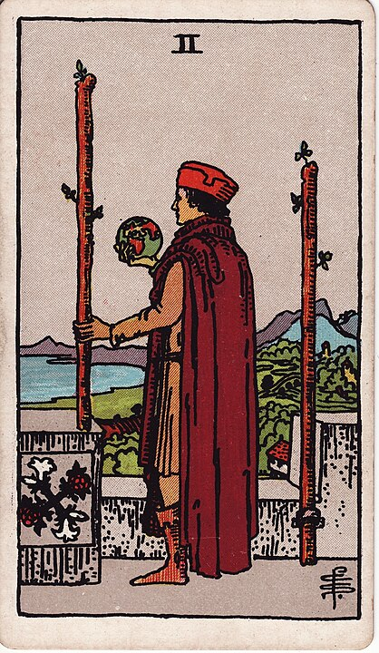

# Wands
Wands are the suit of travel, adventure, and freedom.

## Ace of Wands - Double Entendre

Stop giggling! That's not what this is!
It's supposed to mean "inspiration" or "new opportunites" or something like that.
You're making into a dirty joke!
Anyways, while you have the thick Ace of Wands in your hand you feel very powerful.
Just don't get too excited.

## Two of Wands - Planning

Making a plan for the future. Setting goals. Keeping a day-planner.
Building a Gantt chart. Setting a strategic direction.

## Three of Wands - Progress

Expansion & progress. Lookin' out over your boats on their road to bring you back some capital.

## Four of Wands - Festival

Seems like the plan went well and now we're having a big ol' celebration.

## Five of Wands - Fight Fight Fight!

Everybody's hitting one another with sticks! WHOMP! POW! ZAP!

## Six of Wands - Victory

Having won the fight or competition, you get to ride high.

## Seven of Wands - The Tournament

Challenge! Competition! It's... a lot like the Five of Wands to be honest!

## Eight of Wands - Travel

This card is going places.

## Nine of Wands - Courage

This is like the opposite of the Nine of Swords: Fear? Nah, this is Courage.
Unflappability in the face of danger. Building a wall.

## Ten of Wands - Burden

HOOGH. These are some heavy sticks. Ten is a lot.

## Page of Wands - The Manic Pixie Dream Girl

Inspiration! Ideas! No limits! No boundaries! A free spirit!

This person is honestly pretty fucking exhausting.

## Knight of Wands - The Adventure Idiot

Nobody knows how this guy got a horse, himself included.

He's embroiled in some vast and ridiculous adventure of his own concoction.

He's got a lot in common with The Fool.

## Queen of Wands - The Social Network

Courage, confidence, cat pictures. This woman is friends with everyone, a
celebrity. She's at every party, she seems to know everybody and is known by everyone.
At the seat of the mystery, though, is the terrible secret that she can't
share with anybody: she's not actually very exciting at all.

## King of Wands - The Visionary

His big dreams actually worked out, and now it's his job to have more, bigger dreams.
Which... he does.