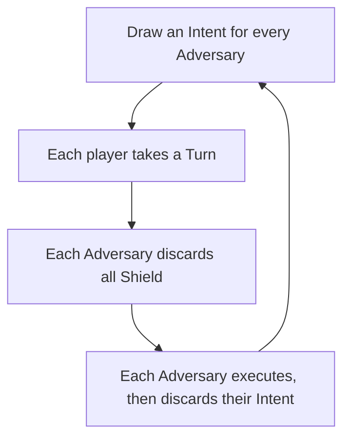
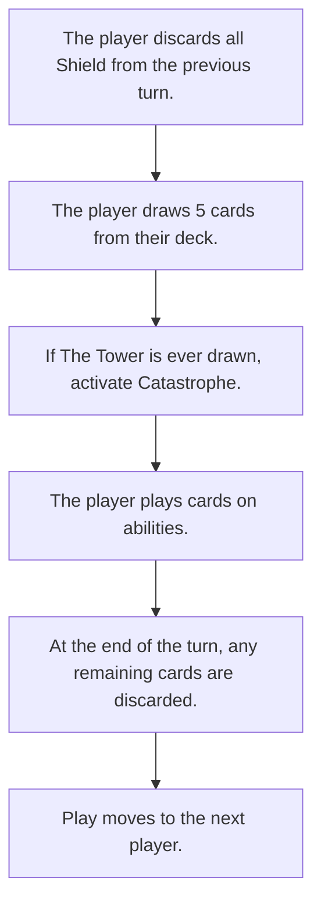

# Combat
Combat is triggered any time the players get into a scuffle with an Adversary or Adversaries.

The goal of Combat is to deal damage to Adversaries until they stop fighting.

## Summary
Players and adversaries draw hands of cards, then play them into a variety of "bins" that are available to them, corresponding
with unique combat abilities.

The [Combat Abilities](/generated/printables/combat.html) are abilities that are available to every player, in combat.

Players also have access to [Magic](./magic.md) as well as a suite of abilities provided by their [Major Arcana](./choosing_major_arcana.md).

These cards mostly are involved with generating [Damage](#damage) and [Shields](#shield).

## Choosing Arcana Abilities

Once players can see the Adversaries they will be fighting, they can choose which of their Arcana Abilities they will be bringing in to combat. Players can choose 2 Arcana Abilities. Mark the Arcana Abilities so chosen (perhaps by dropping a token on them).

On top of that, players can take a Corruption Point at _any time during combat_ to bring in an extra Arcana Ability.

Any Arcana Ability that has been fully upgraded with Corruption is also _automatically added_ to the set of Arcana Abilities available to the player: this allows players with a lot of Corruption to field lots of extra abilities.

## Hit Points
Players start every combat with 20 HP, a number that resets with _every combat_.

> This can be represented with a 20-sided-die, a stack of 20 poker chips, or by writing the number on a scrap of paper.

When a player reaches 0 HP, they do not die, but instead must buy 15 more HP. In order to do so, they
must take a [Major Injury](./injuries.md).

## A Round, and Turn Order

A Round of battle is a cycle where every participant gets one turn.

First, an Intent is drawn for every Adversary. This is a tarot card drawn from the GM's deck
that determines what the Adversary will do on their turn.
Most Adversaries draw Intents face-up, making their intentions clear to the players up-front,
some Adversaries draw Intents face down.

Then, players each take a turn. Fast players first, then players without Fast or Slow, then Slow players.

"What if there are more than one player who can take a turn at the same time?"

They can decide between themselves who goes first. Players can play simultaneously, with the following caveat.

> ##### Why _can't_ players play simultaneously?
> I'm pretty sure that there's a way for players operating at the same time to trigger some kind of infinite loop.
> Player A gives player B more cards, which allow Player B to give player A more cards...
>
> If this happens for some reason, the GM can call shenanigans and demand that one player finish their turn
> before the other player continues.

Finally, each Adversary does whatever their Intent indicates that they will do.

At the end of the Round, every player discards any Shield that they accumulated but did not use to block Damage from an Adversary.

## A Turn

At the beginning of their turn, a player draws 5 cards from their deck.
If they have cards in their hand already at the beginning of their turn, they may keep them.

If there are not enough cards in their deck to draw 5 cards,
they shuffle their discard pile into their deck, and then draw 5 cards from their deck.

These cards constitute the player's "hand" for the turn.

The player plays cards on the various Combat abilities available to their character.
If a player can not play a card, it is discarded at the end of the turn: there is no saving of cards for the next hand.

## Damage

Damage! When a player or Adversary generates Damage, it reduces the Hit Points of a target of their choice.

Most Damage is melee-range: see "[Movement](#movement)" below.

When an Adversary's Hit Points reach 0, they are no longer participants in the combat. The player who pushed the Adversary
over the line gets to decide whether they killed, incapacitated, or scared off the Adversary.

### What Happens when an Adversary Can Choose Who to Damage?

Unless otherwise specified, an Adversary will hit:
* The player with the most remaining Shields. If all players have 0 Shields:
* The player with the least remaining HP.

Some Adversaries operate differently:

* A **Strategic** Adversary will target whichever target the GM wants, and will choose wisely.
* A **Dimwitted** Adversary will target whichever target the GM wants, and will choose badly.

## Movement

Movement in combat happens on a small grid.

Most common rooms in RT:0 are 3x3 grids. Each square of the grid constitutes a Zone, and the Zone can
be shared by as many folks as care to cram themselves in to it. If you are in the same Zone as an Adversary,
the two of you are in melee range of one another.

* Damage can only hit when both the damag-er and damag-ee are in the same Zone.
* Ranged Damage can hit anyone, from anywhere.

Some rooms are large, these are represented by a 5x5 grid.

Some rooms are cramped, these are represented by a 1x1 grid. (_Which is, notably, just a single square. Sorry, ranged abilities!_)

### What Happens when an Adversary Gets to Move?

Unless otherwise specified, an Adversary will:
* Move towards the nearest Player.
* if they are in the same Zone as a player, they won't move at all.

* A **Strategic** Adversary can use their move however the GM wants.

## Shield

Players and Adversaries can generate Shield. For each Shield generated, the player can offset a single point of Damage received:
so if a player takes 8 Damage, but has 5 Shield, they only end up losing 3 HP.

Shield is temporary, and only lasts for, essentially, the next damage phase after the Shield was generated.

* At the end of all player turns, (after every Player has dealt Damage), all Adversary Shields are discarded.
* At the end of a combat Round, (after every Adversary has dealt Damage), all player Shields are discarded.

## Numerical Values of Tarot Cards

* Ace - 1
* 2 through 10 - as listed
* Page - 11
* Knight - 12
* Queen - 13
* King - 14
* Major Arcana - use the Roman Numeral: The Fool is 0, The Chariot is 7, Death is 13, etc.

## Magic
Characters can cast [spells](./magic.md) in battle!

Spells work just like combat abilities, but they generally require The Magician to be played to activate them.

## Conclusion & Supremacy

The Combat is over when all adversaries have fled or been knocked down to 0HP.

Adversaries knocked down to 0HP may have been knocked unconscious, killed, or simply incapacitated: that's
up to the players and the GM.

When a Combat concludes, open up the Supremacy Worksheet:
* If any player has received an Injury, do not add anything to the Supremacy Worksheet. Stop here.
* If any player has received 2 or more Corruption, do not add anything to the Supremacy Worksheet. Stop here.
* Add a tally to the Supremacy Worksheet.
* If all players have full HP: add another tally to the Supremacy Worksheet.

Accumulated Supremacy makes combat _more difficult_ as the game goes on.