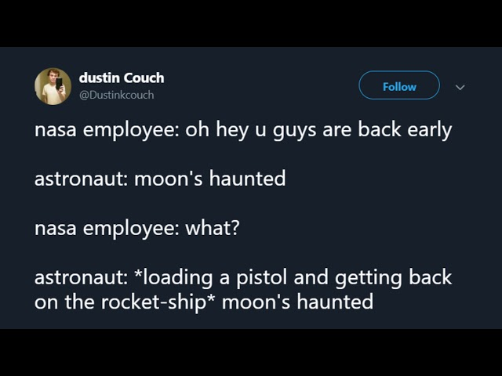

# Introduction

_Haunted teenagers must survive one school year on a moonbase with an insane computer._

Remaining Teenagers: Zero, (or **RT:0** for short), is a sci-fi/fantasy tabletop roleplaying game played with Tarot decks.

In this game, a handful of players will take on the roles of teenagers with mysterious powers,
while their **GM** (Game Manager) will help manage the simulation of their school year on the moon.

RT:0 is intended to be played with 3-4 players and one GM.
It might also work with other player counts!

## Story

Paradise Lua is the first ever moon colony.

Fully privately funded and operating outside of the
boundaries of any government entity,  it was marketed as both a luxurious
land-ownership opportunity for the hyper rich and a brave new frontier for the common man.

Founded in 1986, more than 50 years ago, news and footage from Paradise Lua have largely trailed off.
Nobody seems interested in space anymore. What's been happening up there?

Then, Paradise Lua quietly announced their ACCELER8 program. 8 exceptional teenagers from Earth would
be invited to a prestigious private academy on the moon: The Daybreak Institute.

It made the news, and thousands of teenagers applied, but only 8 were chosen.

1 died in transit.

The remaining teenagers must survive their school year on Paradise Lua.

Bad News: Paradise Lua is a dangerous place.

Good News: The teenagers quickly discover reservoirs of inexplicable psychic powers.

Bad News: Using these powers comes at a terrible cost.

## Vibe & Inspiration Word Cloud:

* Someone needed to write a game that uses a Tarot deck as a resolution mechanism.
* Moon. Insane computer. Cassette futurism.
* Hex-crawl spelunking through abandoned visions of a better future.
* Slay the Spire.
* Paradise Killer (the video game). Citizen Sleeper (the video game).
* Retro-tech. Cult. Conspiracy.
* Paranoia (the RPG). Paranoia (the concept).
* Heart (the RPG).
* Danganronpa. Persona. The SCP Foundation.
* Neil Gaiman (the human being). Charles Stross (also a human being, presumably).
* Tarot. Magic powers. Haunted. Apocalyptic.
* <small>Maybe a little Homestuck</small>.
* Inscrutable rules that you _must_ follow.
* Facing god and walking backwards into hell.
* Coming-of-age. Redemption.

## A Quick Overview of Gameplay

In a modern table-top roleplaying game, players design a "character" for themselves, choosing their attributes and qualities.

The **GM** (Game Manager) will describe a scene to the players, and then players will respond by describing
how their character would respond to that situation.

While players are exploring the moon, they will manage most of their interactions using [Skill Checks](./skill_checks.md),
short interactions where they draw cards from their Tarot decks to determine success or failure at a variety of tasks.

Periodically, players will enter [Combat](./combat.md), where they will draw hands of cards and play them to
deal damage to and block damage from a variety of _moon adversaries_.

## Content Warning

This game features _teenagers dying_. Like, quite a bit and fairly unavoidably.

Beyond that, the content of the game is going to be largely a conversation with
your GM. Be sure to familiarize yourselves with the [Safety Tools](./safety.md).

## Disclaimer Vis-a-Vis Occult Shenanigans

This game features ideas and elements of cartomancy, astrology, and esoteric
occult beliefs which are not taken terribly _seriously_.

If you are a deep believer in these concepts, either out of religious aversion
to them, or spiritual attraction to them, elements of this game may not
be up your alley.

## Source:

Source code for this book is available on [GitHub](https://github.com/cube-drone/rt0).